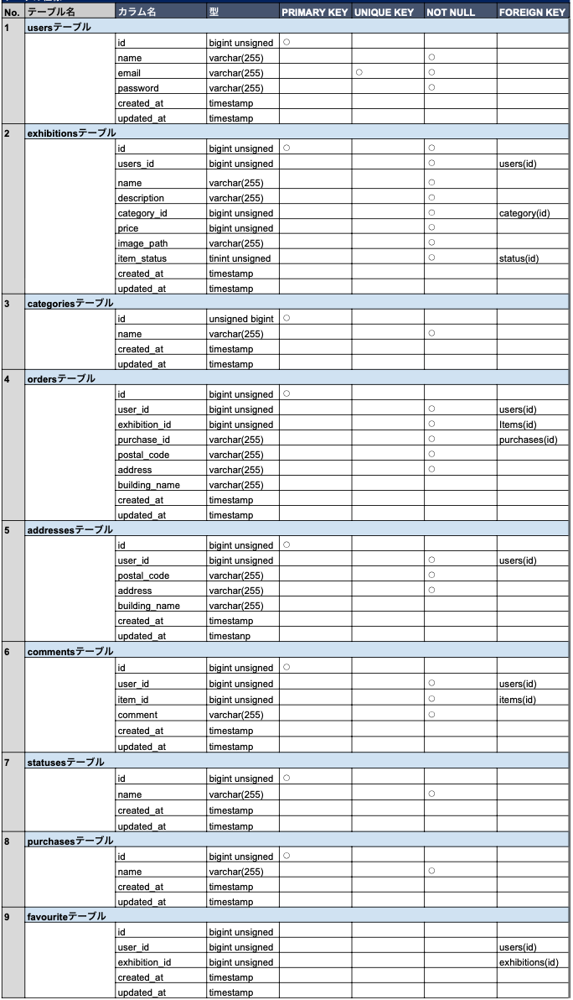
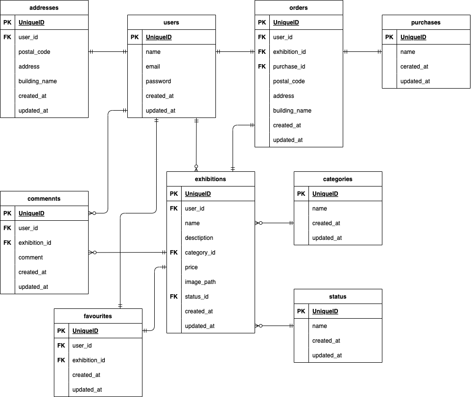

# coachteachフリマ(フリマアプリ)

## 作成した目的

このアプリは、ユーザーが商品を出品・購入できるフリマ（マーケット）アプリです。
商品管理、ユーザー認証、取引履歴の管理など、オンラインのマーケットプレイスで必要な基本機能を提供します。

## アプリケーションの URL

## 機能一覧

- ユーザー認証機能：登録・ログイン
- メール認証機能
- 商品の出品・編集・削除
- 商品の検索・フィルタリング
- 商品詳細ページ
- 取引履歴の管理
- 購入機能（カート、購入機能）
- 決済機能（カード情報の処理）

## 使用技術(実行環境)

- PHP 8.3.0
- Laravel 8.83.27
- MySQL 8.0.26

## テーブル設計図



## ER 図



## 環境構築

**Docker セットアップ**

1. `git clone git@github.com:oidon122/coachtech-freemarket.git`
2. DockerDesktop アプリを立ち上げる
3. `docker-compose up -d --build`

> _Mac の M1・M2 チップの PC の場合、`no matching manifest for linux/arm64/v8 in the manifest list entries`のメッセージが表示されビルドができないことがあります。
> エラーが発生する場合は、docker-compose.yml ファイルの「mysql」内に「platform」の項目を追加で記載してください_

```bash
mysql:
    platform: linux/x86_64(この文追加)
    image: mysql:8.0.26
    environment:
```

**Laravel 環境構築**

1. `docker-compose exec php bash`
2. `composer install`
3. 「.env.example」ファイルを 「.env」ファイルに命名を変更。または、新しく.env ファイルを作成
4. .env に以下の環境変数を追加

```text
DB_CONNECTION=mysql
DB_HOST=mysql
DB_PORT=3306
DB_DATABASE=laravel_db
DB_USERNAME=laravel_user
DB_PASSWORD=laravel_pass

MAIL_MAILER=smtp
MAIL_HOST=mailhog
MAIL_PORT=1025
MAIL_USERNAME=null
MAIL_PASSWORD=null
MAIL_ENCRYPTION=null
MAIL_FROM_ADDRESS=no-reply@example.com
MAIL_FROM_NAME=coachtech-freemarket
```

5. アプリケーションキーの作成

```bash
php artisan key:generate
```

6. マイグレーションの実行

```bash
php artisan migrate
```

7. シーディングの実行

```bash
php artisan db:seed
```

## URL

- 開発環境：http://localhost/
- phpMyAdmin：http://localhost:8080/
- Mailhog(開発用メール確認ツール)：http://localhost:8025
# coachtech-freemarket
